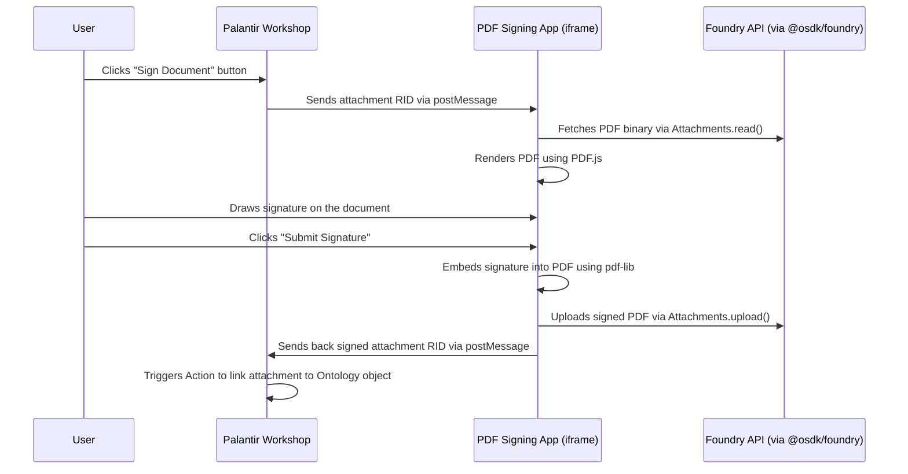

# PDF Signing Frontend for Palantir Workshop

A React frontend embedded in a Palantir Workshop iframe that receives a PDF, displays it for signing, and uploads the signed PDF back to Foundry using the official `@osdk/foundry` TypeScript SDK.

---

## Architecture Overview



---

## Tech Stack

| Layer | Technology | Purpose |
|---|---|---|
| **Framework** | React + Vite | Fast dev server, modern build tooling |
| **Workshop Comms** | `@osdk/workshop-iframe-custom-widget` | Bidirectional postMessage with Workshop |
| **Foundry SDK** | `@osdk/foundry`, `@osdk/client`, `@osdk/oauth` | Official TypeScript SDK for Foundry APIs |
| **PDF Rendering** | `pdfjs-dist` (PDF.js) | Render PDF pages onto HTML5 canvas |
| **Signature Capture** | `signature_pad` | Smooth, Bézier-interpolated signature drawing |
| **PDF Modification** | `pdf-lib` | Embed signature image into the PDF binary |
| **Styling** | Vanilla CSS | Premium, polished UI |

---

## Proposed Changes

### 1. Project Scaffolding

#### [NEW] Project root (`c:\Users\abhis\Documents\notepadToPDF\notepadToPDF`)

```bash
npx -y create-vite@latest ./ --template react
npm install
npm install @osdk/foundry @osdk/client @osdk/oauth @osdk/workshop-iframe-custom-widget
npm install pdfjs-dist signature_pad pdf-lib
```

---

### 2. Foundry Client Setup

#### [NEW] [foundryClient.js](file:///c:/Users/abhis/Documents/notepadToPDF/notepadToPDF/src/services/foundryClient.js)

Creates the platform client using the official SDK:

```javascript
import { createPlatformClient } from "@osdk/client";
import { createPublicOauthClient } from "@osdk/oauth";

const stack = "<YOUR_FOUNDRY_STACK_URL>"; // e.g. https://foundry.example.com
const clientId = "<YOUR_OAUTH_CLIENT_ID>";  // from Developer Console
const redirectUrl = window.location.origin;

const auth = createPublicOauthClient(clientId, stack, redirectUrl);
export const client = createPlatformClient(stack, auth);
```

> [!IMPORTANT]
> **Prerequisite:** You must register a **third-party application** in Foundry's Developer Console with:
> - **Grant type:** Public OAuth2 (Authorization Code + PKCE)
> - **Redirect URL:** The URL where this app is hosted
> - **Scopes:** `api:ontologies-read`, `api:ontologies-write`
> - The Client ID from this registration goes into the config above.

---

### 3. Workshop Communication Layer

#### [NEW] [workshopBridge.js](file:///c:/Users/abhis/Documents/notepadToPDF/notepadToPDF/src/services/workshopBridge.js)

Uses `@osdk/workshop-iframe-custom-widget` to:
- **Receive** an attachment RID from Workshop (string variable — the PDF to sign)
- **Send back** the signed PDF's attachment RID (string variable) after upload
- **Trigger** a Workshop event to confirm signing completion

```javascript
import { useWorkshopContext } from "@osdk/workshop-iframe-custom-widget";

// Called in the main React component
const context = useWorkshopContext({
  variables: {
    pdfAttachmentRid: { type: "string" },       // INPUT: PDF to sign
    signedAttachmentRid: { type: "string" },     // OUTPUT: signed PDF RID
  },
  events: {
    signingComplete: {},                          // Fires when done
  },
});
```

---

### 4. Foundry Attachment Service

#### [NEW] [attachmentService.js](file:///c:/Users/abhis/Documents/notepadToPDF/notepadToPDF/src/services/attachmentService.js)

Uses `@osdk/foundry` SDK for attachment operations:

**Download PDF:**
```javascript
import { Attachments } from "@osdk/foundry.core";

async function downloadPdf(client, attachmentRid) {
  const content = await Attachments.read(client, attachmentRid);
  return content; // Binary content as Blob
}
```

**Upload Signed PDF:**
```javascript
async function uploadSignedPdf(client, pdfBytes, filename) {
  const blob = new Blob([pdfBytes], { type: "application/pdf" });
  const attachment = await Attachments.upload(client, blob, {
    filename: filename || "signed_document.pdf",
  });
  return attachment.rid; // Return the new attachment RID
}
```

---

### 5. PDF Viewer Component

#### [NEW] [PdfViewer.jsx](file:///c:/Users/abhis/Documents/notepadToPDF/notepadToPDF/src/components/PdfViewer.jsx)

Renders the PDF using PDF.js:
- Loads the PDF binary (`Uint8Array`) and renders each page onto `<canvas>`
- Supports **pagination** (prev/next) and **zoom** controls
- Shows a **signature placement overlay** where the user can position their signature

---

### 6. Signature Input Component (Draw + Type)

#### [NEW] [SignatureModal.jsx](file:///c:/Users/abhis/Documents/notepadToPDF/notepadToPDF/src/components/SignatureModal.jsx)

A modal with **two tabs** for capturing the signature:

**Tab 1 — Draw:**
- Uses `signature_pad` library on a `<canvas>` element
- **Clear**, **Undo**, and **Done** buttons
- Captures freehand signature as PNG

**Tab 2 — Type:**
- Text input where the user types their name
- Renders the typed text in a selection of **cursive/handwriting fonts** (e.g., *Dancing Script*, *Great Vibes*, *Satisfy* from Google Fonts)
- Live preview of the typed signature in each font; user clicks to select one
- Converts the styled text to a PNG image via an offscreen `<canvas>` for embedding

Both tabs export the final signature as `data:image/png;base64,...` so the rest of the pipeline (placement + PDF embedding) works identically regardless of input method.

---

### 7. Signature Embedding Logic

#### [NEW] [pdfSigner.js](file:///c:/Users/abhis/Documents/notepadToPDF/notepadToPDF/src/services/pdfSigner.js)

Uses `pdf-lib` to embed the signature into the PDF:

```javascript
import { PDFDocument } from "pdf-lib";

async function embedSignature(pdfBytes, signaturePngBase64, position) {
  const pdfDoc = await PDFDocument.load(pdfBytes);
  const signatureImage = await pdfDoc.embedPng(signaturePngBase64);
  const page = pdfDoc.getPage(position.pageIndex);

  page.drawImage(signatureImage, {
    x: position.x,
    y: position.y,
    width: position.width,
    height: position.height,
  });

  return await pdfDoc.save(); // Returns Uint8Array
}
```

---

### 8. Main Application Flow

#### [MODIFY] [App.jsx](file:///c:/Users/abhis/Documents/notepadToPDF/notepadToPDF/src/App.jsx)

Orchestrates the full signing flow:

| State | UI |
|---|---|
| `WAITING` | "Waiting for document..." spinner |
| `LOADING` | "Loading PDF..." progress indicator |
| `VIEWING` | PDF viewer with "Add Signature" button |
| `SIGNING` | Signature pad modal open |
| `PLACING` | User dragging the signature to position on PDF |
| `SUBMITTING` | "Uploading signed document..." spinner |
| `DONE` | "✅ Document signed successfully!" |
| `ERROR` | Error message with retry option |

---

### 9. Styling

#### [NEW] [index.css](file:///c:/Users/abhis/Documents/notepadToPDF/notepadToPDF/src/index.css)

Premium dark-mode design with glassmorphism, smooth gradients, animated transitions, Google Fonts (Inter/Outfit), responsive layout for Workshop iframe.

---

### 10. Dev Mode (for testing without Foundry)

A dev-mode flag enables standalone testing:
- Loads a sample PDF from `public/sample.pdf` instead of waiting for Workshop
- Skips the Foundry upload and downloads the signed PDF locally
- Enabled via environment variable: `VITE_DEV_MODE=true`

---

## File Structure

```
notepadToPDF/
├── index.html
├── package.json
├── vite.config.js
├── .env.example                 ← Template for FOUNDRY_STACK, CLIENT_ID, etc.
├── public/
│   ├── pdf.worker.min.mjs       ← PDF.js web worker
│   └── sample.pdf               ← Sample PDF for dev-mode testing
└── src/
    ├── main.jsx
    ├── App.jsx                   ← Main orchestrator (state machine)
    ├── index.css                 ← Global styles
    ├── components/
    │   ├── PdfViewer.jsx         ← PDF rendering with PDF.js
    │   ├── SignatureModal.jsx    ← Modal with Draw + Type tabs
    │   ├── SignaturePlacer.jsx   ← Drag-to-position signature on PDF
    │   ├── StatusOverlay.jsx     ← Loading/success/error states
    │   └── Toolbar.jsx           ← Zoom, page nav, submit controls
    └── services/
        ├── foundryClient.js      ← @osdk/client + @osdk/oauth setup
        ├── attachmentService.js  ← Attachments.upload() / read() via SDK
        ├── workshopBridge.js     ← Workshop iframe communication
        └── pdfSigner.js          ← Embed signature into PDF with pdf-lib
```

---

## Foundry-Side Setup (Manual — Outside this codebase)

1. **Developer Console:** Register a third-party app, get OAuth Client ID
2. **CSP:** Allow the app's hosting domain for iframe embedding + API calls
3. **CORS:** Allow the app's origin for Foundry API calls
4. **Workshop Module:**
   - Add **Iframe widget** → set to **Bidirectional** mode
   - String input variable → PDF attachment RID
   - String output variable → signed PDF attachment RID
   - Event → "signing complete"
   - Button triggers workflow (sets the PDF RID, navigates to signing screen)
5. **Action:** Link the returned signed attachment RID to the Ontology object
6. **Hosting:** Deploy as a Foundry Website or host externally

---

## Verification Plan

### Local Dev-Mode Testing
```bash
npm run dev   # Open http://localhost:5173
```
1. Sample PDF renders correctly with page navigation
2. "Add Signature" opens the signature pad modal
3. Drawing + "Done" places signature on the PDF
4. "Submit" downloads a signed PDF locally
5. Signed PDF opens correctly with embedded signature

### Integration Testing with Foundry
1. Build (`npm run build`) and deploy to Foundry Website
2. Configure Workshop iframe widget with bidirectional variables
3. Click Workshop button → PDF loads in iframe
4. Sign and submit → signed attachment RID returned to Workshop
5. Action links signed attachment to correct Ontology object
